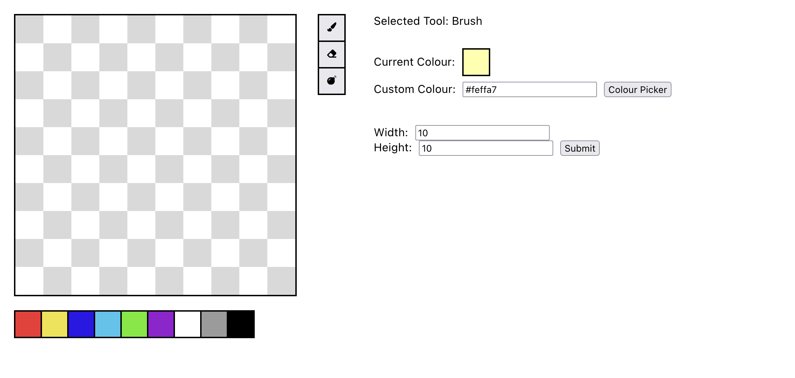
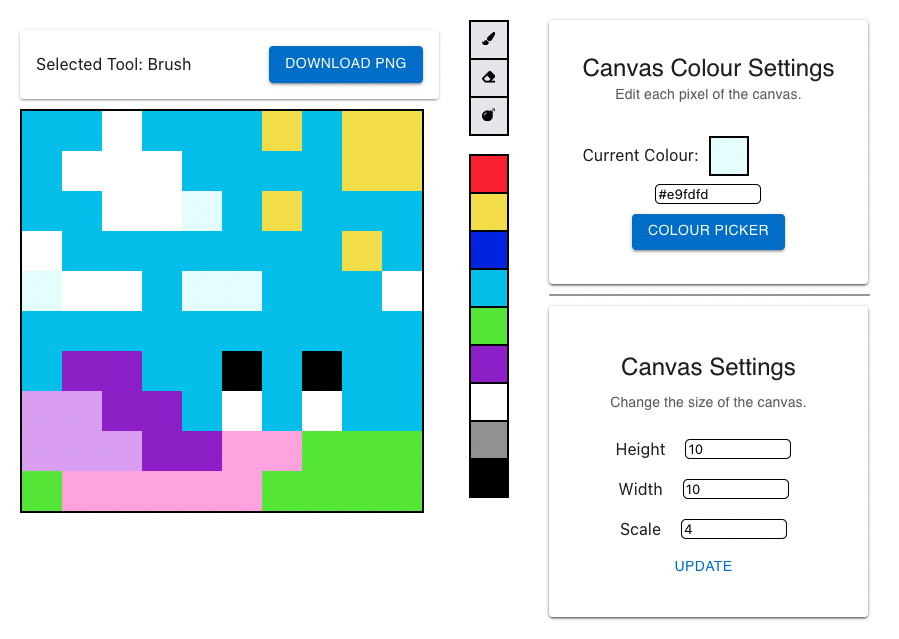

    <h1 align = "center">Pixel Art Maker - Created in React!</h1>

    Pixel Art Maker is a small website where you can create simple pixel art. This website is just a small project I decided to make to teach myself Typescript and better my ReactJS skills.

 

<h2>Current features:</h2>
<ul>
  <li>Resize pixel canvas</li>
  <li>Custom and pre-defined colours</li>
  <li>Paint colours onto the canvas</li>
  <li>Erase colours painted on the canvas</li>
  <li>Export image as 'PNG' (not transparent)</li>
<ul>

<h2>Planned features:</h2>
  <li>Export other image formats</li>
  <li>PNG transparency option</li>
  <li>Better website design</li>
  <li>Better website accessability (responsive sizing)</li>
  <li>Save custom colours</li>
  <li>More tools:</li>
  <ul>
    <li>Bucket</li>
    <li>Clear canvas</li>
  </ul>
</ul>

## Possible ideas:
- Ability to animate

## Contribution
Feel free to create a pull request and add some new features or clean up the code (I know it's a bet messy). Any help is appreciated.
