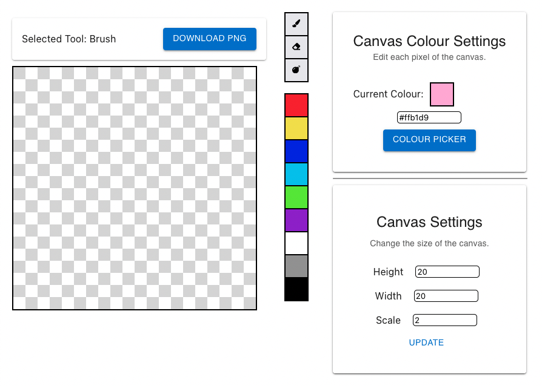

    <h1 align = "center">Pixel Art Maker - Created in React!</h1>

    Pixel Art Maker is a small website where you can create simple pixel art. This website is just a small project I decided to make to teach myself Typescript and better my ReactJS skills.

 

## Current features:
- Resize pixel canvas
- Custom and pre-defined colours
- Paint colours onto the canvas
- Erase colours painted on the canvas

## Planned features:
- Image export
- Better website design
- Better website accessability (responsive sizing)
- Save custom colours
- More tools:
  - Bucket
  - Clear canvas

## Possible ideas:
- Ability to animate

## Contribution
Feel free to create a pull request and add some new features or clean up the code (I know it's a bet messy). Any help is appreciated.
